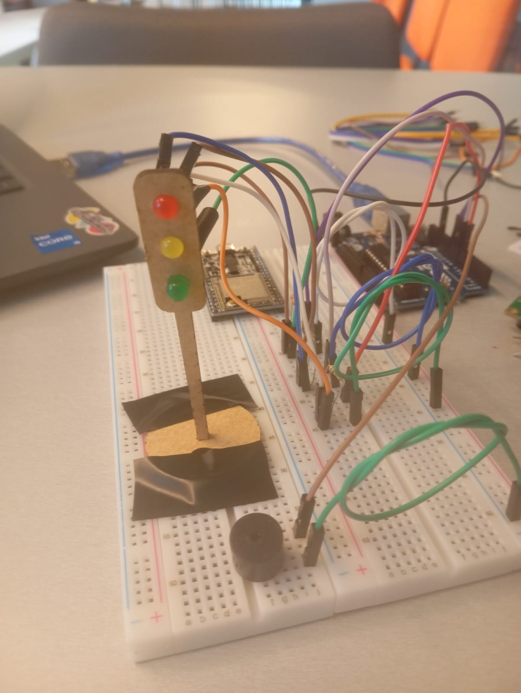

# Ponderada semáforo

&nbsp;&nbsp;&nbsp;&nbsp; O presente ponderada tem como objetivo apresentar o processo de construção de um semáforo de leds com o arduino.

## Parte 1: Montagem Física do Semáforo

&nbsp;&nbsp;&nbsp;&nbsp; Na figura abaixo, é apresentada a montagem dos LEDs, assim como a de um buzzer que emitirá um som de alerta enquanto a luz estiver vermelha. Além disso, na página *assets* contém o video do funcionamento do semáfora.

&nbsp;&nbsp;&nbsp;&nbsp; Componentes utilizados:

| Item                          | Quantidade | Categoria         | Especificações                    
|-------------------------------|------------|-------------------|--------------------------------------|
| Fios jumpers                  | 9     | Conexão          | Fios tipo macho-macho |
| Fios jumpers                  | 6     | Conexão          | Fios tipo macho-femea |
| Estrutura para representar o semáforo | 1      | Estrutura        | Estrutura de MDF para representar o semáforo e de suporte para os LEDs |                  
| Arduino UNO                   | 1          | Microcontrolador | -              | 
| Resistores                    | 3          | Componente eletrônico | Resistência de 220 ohms     | 
| LED Vermelho                  | 1          | Componente eletrônico | Led convencional               | 
| LED Amarelo                   | 1          | Componente eletrônico | Led convencional            | 
| LED Verde                     | 1          | Componente eletrônico | Led convencional               | 
| Buzzer                        | 1          | Componente eletrônico | Buzzer padrão                          | 

<br>

<div align="center">

    

</div>

&nbsp;&nbsp;&nbsp;&nbsp; Para maior clareza, segue abaixo o tinkercad do circuito mencionado.

<div align="center">

    

</div>

## Parte 2: Programação e Lógica do Semáforo

&nbsp;&nbsp;&nbsp;&nbsp; Segue abaixo, o código para lógica do semáforo solicitado.

```cpp

#define LED_VERMELHO 8
#define LED_AMARELO 7
#define LED_VERDE 9
#define BUZZER_PIN 10

void setup() {
  pinMode(LED_VERMELHO, OUTPUT);
  pinMode(LED_AMARELO, OUTPUT);
  pinMode(LED_VERDE, OUTPUT);
  pinMode(BUZZER_PIN, OUTPUT);
}

void loop() {

  digitalWrite(LED_VERMELHO, HIGH);
  for (int i = 0; i < 7; i++) {
    tone(BUZZER_PIN, 1000);
    delay(428.57);
    noTone(BUZZER_PIN);
    delay(428.57);
  }
  digitalWrite(LED_VERMELHO, LOW);
  
  
  digitalWrite(LED_AMARELO, HIGH);
  delay(2000); 
  digitalWrite(LED_AMARELO, LOW);
  
  digitalWrite(LED_VERDE, HIGH);
  delay(2000); 
  digitalWrite(LED_VERDE, LOW);
  delay(1000);
  
  digitalWrite(LED_VERDE, HIGH);
  delay(2000); 
  digitalWrite(LED_VERDE, LOW);
  
  digitalWrite(LED_AMARELO, HIGH);
  delay(2000); 
  digitalWrite(LED_AMARELO, LOW);
}

```

## Parte 3: Avaliação de Pares

### Avaliador: Nataly

| Critério                                                                                                 | Contempla (Pontos) | Contempla Parcialmente (Pontos) | Não Contempla (Pontos) | Observações do Avaliador |
|---------------------------------------------------------------------------------------------------------|--------------------|----------------------------------|--------------------------|---------------------------|
| Montagem física com cores corretas, boa disposição dos fios e uso adequado de resistores                | Até 3              | Até 1,5                            | 0                        |    3                       |
| Temporização adequada conforme tempos medidos com auxílio de algum instrumento externo                  | Até 3              | Até 1,5                          | 0                        |     3                      |
| Código implementa corretamente as fases do semáforo e estrutura do código (variáveis representativas e comentários) | Até 3              | Até 1,5                          | 0                        |       3                    |
| Extra: Implmeentou um componente de liga/desliga no semáforo e/ou usou ponteiros no código | Até 1              |  Até 0,5                         | 0                        |      1                     | 
|  |                                                             |  | |**Pontuação Total:** 10|

### Avaliador: Mariella

| Critério                                                                                                 | Contempla (Pontos) | Contempla Parcialmente (Pontos) | Não Contempla (Pontos) | Observações do Avaliador |
|---------------------------------------------------------------------------------------------------------|--------------------|----------------------------------|--------------------------|---------------------------|
| Montagem física com cores corretas, boa disposição dos fios e uso adequado de resistores                | Até 3              | Até 1,5                            | 0                        |    3                       |
| Temporização adequada conforme tempos medidos com auxílio de algum instrumento externo                  | Até 3              | Até 1,5                          | 0                        |     3                      |
| Código implementa corretamente as fases do semáforo e estrutura do código (variáveis representativas e comentários) | Até 3              | Até 1,5                          | 0                        |       3                    |
| Extra: Implmeentou um componente de liga/desliga no semáforo e/ou usou ponteiros no código | Até 1              |  Até 0,5                         | 0                        |      1                     | 
|  |                                                             |  | |**Pontuação Total:** 10|
